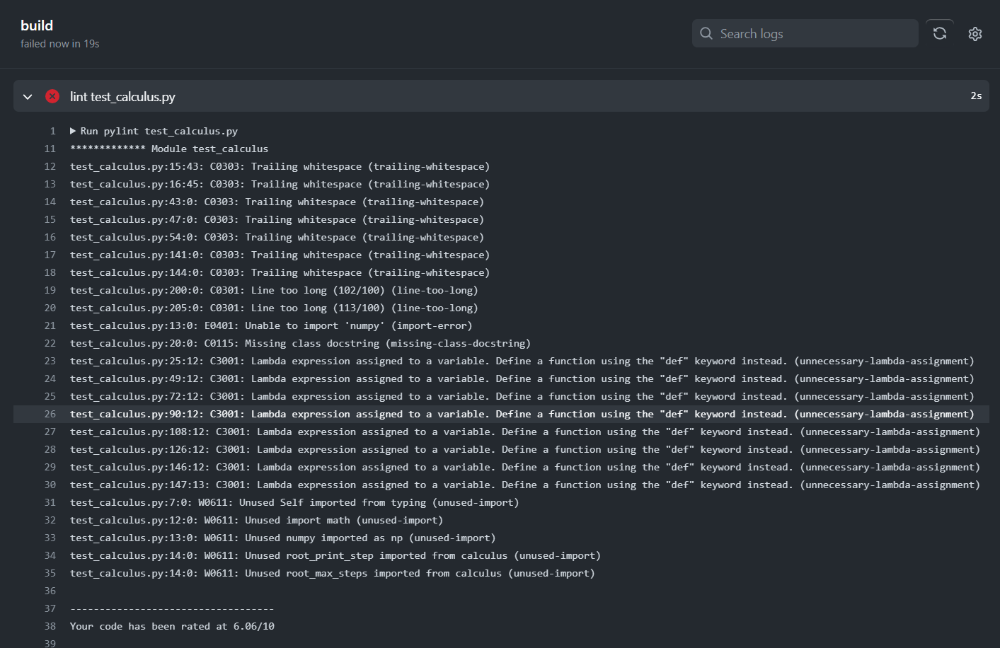
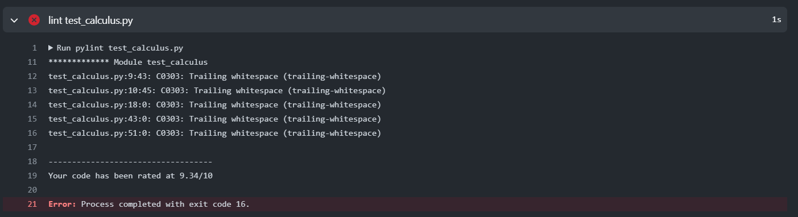
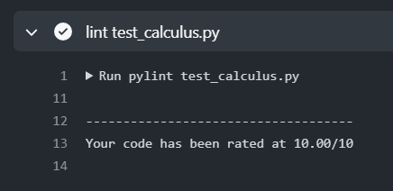
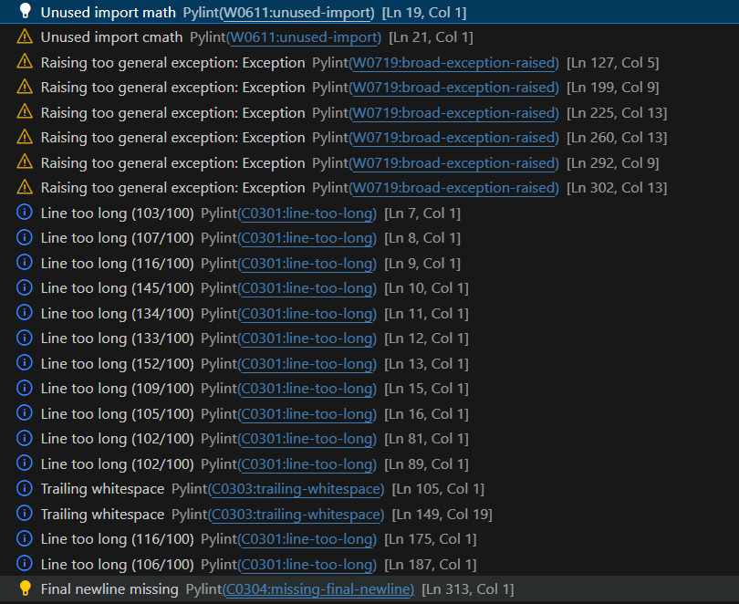

# Comparing Numerical Integration Techniques and Enhancing Calculus.py: Automating Linting and Testing with GitHub Actions

## Task Overview:
- Compare the numpy integration functions to the ones found in compphys
- Add missing docstrings in calculus.py
- Reuse github actions for linting and unit tests for calculus.py
- Write unit tests for functions in calculus.py

# Numerical Integration Comparision:  NumPy vs CompPhys

**NumPy**, the core Python library for scientific computing, provides numerous functions for numerical integration. Some of them are:

**1. simps:** This function is NumPy built-in. It uses Simpson's rule and  performs numerical integration using Simpson's rule. It is particularly useful for integrating data represented by arrays. Simpson's rule is a numerical integration technique that provides a more accurate approximation of the integral by fitting parabolic sections to the curve. We can see the implementation of Simpson rule in [CompPhys Integration](https://github.com/ubsuny/CompPhys/blob/main/Calculus/integrals.py) as well. 
```python
def simpson(f, a, b, n):
    """Approximates the definite integral of f from a to b by
    the composite Simpson's rule, using n subintervals.
    From http://en.wikipedia.org/wiki/Simpson's_rule
    """
    h = (b - a) / n
    i = np.arange(0,n)
    
    s = f(a) + f(b) 
    s += 4 * np.sum( f( a + i[1::2] * h ) )
    s += 2 * np.sum( f( a + i[2:-1:2] * h ) )
    
    return s * h / 3
```

**2. trapz:** It is pramary function for integration in NumPy. This function applies the trapezoidal rule, a method of numerical integration that divides an interval into subintervals and uses trapezoids to calculate the area under the curve in order to approximate the integral. For seamless operations, it is easy to use and effective. This function is also being implemented in the [CompPhys Integration](https://github.com/ubsuny/CompPhys/blob/main/Calculus/integrals.py).
```python
def trapezoid(f, a, b, n):
    """Approximates the definite integral of f from a to b by
    the composite trapezoidal rule, using n subintervals.
    From http://en.wikipedia.org/wiki/Trapezoidal_rule
    """
    h = (b - a) / n
    s = f(a) + f(b)
    i = np.arange(0,n)
    s += 2 * np.sum( f(a + i[1:] * h) )
    return s * h / 2
```

**3. cumsum:** Although cumsum isn't a formal integration function, it may be used to calculate an array's cumulative sum, which is the definite integral of the derivative of the function. It can be applied to the integration of monotonically growing functions or the computation of running totals.
```python
def cumsum(x, axis=-1):
    """
    Calculates the cumulative sum of an array.

    Parameters:
        x: The array to calculate the cumulative sum for.
        axis (optional): The axis along which to cumsum, an integer value.

    Returns:
        The cumulative sum of the array.
    """

    return np.cumsum(x, axis=axis)
```
 
**4. polyint:** This function allows polynomials to have indefinite integration, or antidifferentiation. It returns the polynomial's antiderivative after receiving a series of polynomial coefficients. 
```python
def polyint(p):
    """
    Performs indefinite integration of a polynomial.

    Parameters:
        p: The coefficients of the polynomial to integrate, a sequence of values.

    Returns:
        The antiderivative of the polynomial.
    """

    if not p:
        return np.zeros_like(p)

    deg = len(p) - 1
    antiderivative = []
    for i in range(deg + 1):
        antiderivative.append(p[i] / (deg + 1 - i))

    return np.array(antiderivative)
```
**5. diff:** This function approximates the derivative of a function by computing the difference between successive items of an array. The definite integral of the function can be roughly calculated by multiplying the array's negative diff by the element spacing.
```python
def diff(x, n=1, axis=-1):
    """
    Computes the difference between consecutive elements of an array.

    Parameters:
        x: The array to calculate the difference for.
        n (optional): The order of difference, an integer value.
        axis (optional): The axis along which to diff, an integer value.

    Returns:
        The difference array.
    """

    return np.diff(x, n=n, axis=axis)
```

**6. gradient:** A scalar field expressed by a NumPy array can have its gradient calculated using this function. The dot product of a displacement vector and a gradient can be utilized to estimate the definite integral of a vector field.
```python
def gradient(f, dx=1, dy=1):
    """
    Computes the gradient of a scalar field represented by a NumPy array.

    Parameters:
        f: The scalar field, a NumPy array of function values.
        dx (optional): The spacing between x-coordinates, a scalar value.
        dy (optional): The spacing between y-coordinates, a scalar value.

    Returns:
        The gradient of the scalar field, a tuple of NumPy arrays.
    """

    fx = diff(f, axis=1) / dx
    fy = diff(f, axis=0) / dy
    return fx, fy
```

**7. cross:** The cross product of two three-dimensional vectors is computed using this function. By adding the cross products of the vector field and tiny displacement vectors along the curve, it is possible to approximate the line integral of a vector field around a closed curve.
```python
def cross(u, v):
    """
    Calculates the cross product of two three-dimensional vectors.

    Parameters:
        u: The first vector, a NumPy array of shape (3,).
        v: The second vector, a NumPy array of shape (3,).

    Returns:
        The cross product of the vectors, a NumPy array of shape (3,).
    """

    return np.array([u[1]*v[2] - u[2]*v[1], u[2]*v[0] - u[0]*v[2], u[0]*v[1] - u[1]*v[0]])

```
Both NumPy and CompPhys provide functions for numerical integration. We can see that `trapz` and `simps` both are implemented in NumPy and CompPhys. Apart from this, [CompPhys](https://github.com/ubsuny/CompPhys/blob/main/Calculus/integrals.py) has provided another function for integration, i.e., `adaptive_trapezoid` which implements the numerical integration of the adaptive trapezoidal approach. In order to compute the definite integral of a given function f over the interval [a, b] with the necessary degree of accuracy, this approach dynamically modifies the step size.
```python
def adaptive_trapezoid(f, a, b, acc, output=False):
    """Uses the adaptive trapezoidal method to compute the definite integral of the given function.

    Parameters:
    - f (function): The integrand function.
    - a (float): The lower limit of integration.
    - b (float): The upper limit of integration.
    - acc (float): The desired accuracy for stopping the integration.
    - output (bool): If True, print intermediate results during computation.

    Returns:
    float: The approximate integral value.
    """
    old_s = np.inf
    h = b - a
    n = 1
    s = (f(a) + f(b)) * 0.5
    if output == True : 
        print ("N = " + str(n+1) + ",  Integral = " + str( h*s ))
    while abs(h * (old_s - s*0.5)) > acc :
        old_s = s
        for i in np.arange(n) :
            s += f(a + (i + 0.5) * h)
        n *= 2.
        h *= 0.5
        if output == True :
            print ("N = " + str(n) + ",  Integral = " + str( h*s ))
    return h * s
```
| Criteria               | Adaptive Trapezoidal Method `adaptive_trapezoid`                     | `numpy.trapz()` (Trapezoidal Rule)                     | `numpy.simps()` (Simpson's Rule)                          |
|------------------------|--------------------------------------------------|--------------------------------------------------------|-----------------------------------------------------------|
| **Accuracy**           | Adaptive, dynamically adjusts for better precision | Simple approximation, less accurate for curved functions | More accurate, uses parabolic sections for better estimates |
| **Efficiency**         | Adaptive, may require more iterations for accuracy | Computationally efficient, suitable for large datasets  | Slightly slower due to fitting parabolas, more intensive   |
| **Reliability**        | Reliable with adaptive refinement                | Reliable and robust, less sensitive to noise            | Generally reliable, suitable for a broader class of functions |
| **Use Case**           | Adaptive for varying function complexities        | Suitable for smooth functions, simplicity a priority    | Appropriate for functions with curvature or oscillations    |

## Conclusion:
Since the adaptive trapezoidal approach dynamically modifies the step size to attain the required precision, it is useful when the function being integrated has fluctuating complexities. For basic functions, it could need more iterations than `trapz` and `simps`. 

# Docstring Addition to `calculus.py`:
The [calculus.py](https://github.com/ubsuny/23-Homework6G3/blob/main/calculus.py) has been generated with clear, concise, and informative docstrings that accurately reflect the function's purpose, arguments, return values, and potential limitations.

# GitHub Actions for Calculus.py: Linting and Pytest:
Code linting and testing can be done automatically with GitHub Actions. By doing this, we can make sure that the code is clear and error-free.

- For linting unit test cases, the [lint_test_calculus.yml](https://github.com/ubsuny/23-Homework6G3/blob/main/.github/workflows/lint_test_calculus.yml) is generated that keeps the trach of unit test and suggests changes accordingly. I have used pylint to lint [test_calculus.py](https://github.com/ubsuny/23-Homework6G3/blob/main/test_calculus.py), and the 10/10 pylint rating is received in 3 attempts.
**1st attempt**

**2nd attempt**

**3rd attempt**



- For the pytest of [test_calculus.py](https://github.com/ubsuny/23-Homework6G3/blob/main/test_calculus.py), the [unittesting_pytest.yml](https://github.com/ubsuny/23-Homework6G3/blob/main/.github/workflows/unittesting_pytest.yml) is generated and the pytest is satisfied in one attempt.
 

- For linting `calculus.py`, these are pylint suggestions:



 # Unit test for Functions in `calculus.py`:
The unit test cases for several functions in `calculus.py` can be found in [test_calculus.py](https://github.com/ubsuny/23-Homework6G3/blob/main/test_calculus.py).

# Bibliography:
- [NumPy Documentation]( https://numpy.org/doc/stable/)
- [Wikipedia: Simpson's Rule]( https://en.wikipedia.org/wiki/Simpson%27s_rule)
- [Wikipedia: Trapezoidal Rule]( https://en.wikipedia.org/wiki/Trapezoidal_rule)
- [CompPhys Calculus](https://github.com/ubsuny/CompPhys/tree/main/Calculus)
- [numpy.trapz](https://numpy.org/doc/stable/reference/generated/numpy.trapz.html)
- [NumPy.org](https://numpy.org/doc/stable/reference/routines.math.html)
